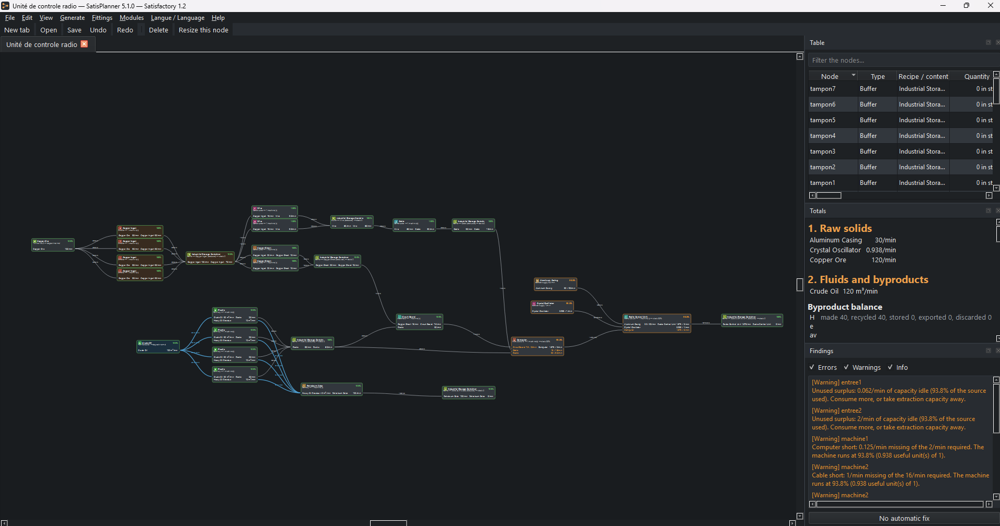
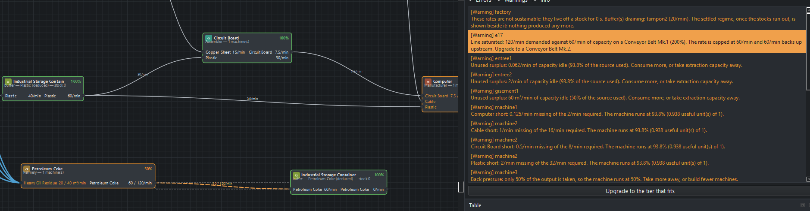
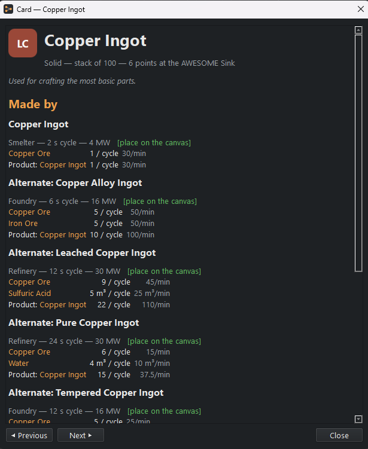
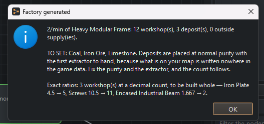
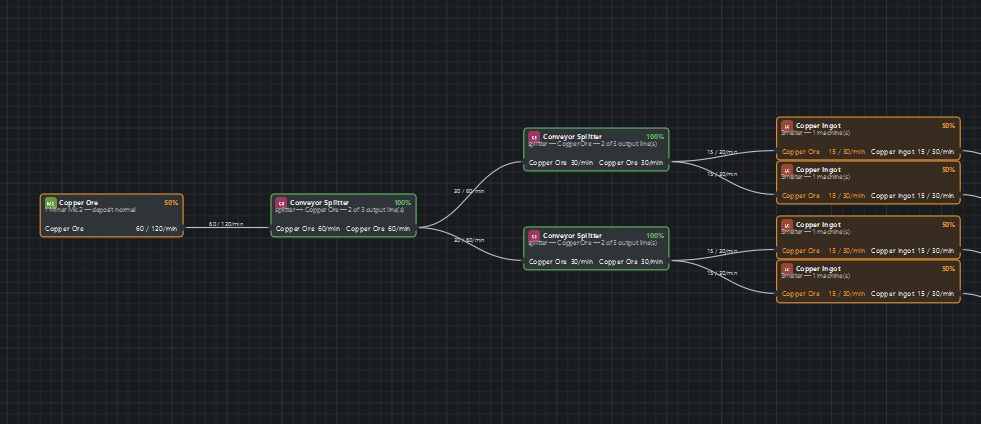

# SatisPlanner

*English — [Français](README.fr.md)*

A planner for **theoretical** Satisfactory 1.2 factories. You drop nodes on a canvas — ore node
→ smelter → constructor → assembler, oil → refinery — join them with belts and pipes, and the
application solves the steady state: throughputs, how many machines are actually useful,
bottlenecks, line saturation, power draw, and the list of buildings to put down.

It is **self-contained**: the recipe database is embedded in the executable, there is nothing to
configure, and **Satisfactory does not have to be installed** on the machine running it.

It is **neither a mod nor a save-file reader**. No interaction with the running game, no network
access at runtime.

**Windows, no installer, MIT licence, free.** Unzip and run.

There are good online calculators for this game, and they answer a different question: you name a
target and they give you the ratios. SatisPlanner reads the other way round — you start from the
resource nodes you actually have, lay the factory out yourself on a canvas, and the diagnostics
carry their own fix. It also runs offline, with the recipe database inside the executable.



## Download

**[Latest release](https://github.com/VictorBousseau/SatisPlanner/releases/latest)** — unzip
anywhere and run `SatisPlanner.exe`. No installer, no dependency, nothing to configure. Windows
may show a SmartScreen warning on first launch: the executable is not signed.

The interface is in English or in French, and follows your system on a first launch.

Three things to know before you open the window, because they are design decisions and
not gaps — the whole list is under [what this tool does not do](#what-this-tool-does-not-do):

- **it reasons about throughput, not geometry** — no distance, no elevation, no pump head;
- **steady state only** — it says whether the rates hold and how long a stock lasts, but it does
  not simulate time passing;
- **no Somersloop.** Overclocking is modelled, from 1 % to 250 %.

## Using it

Palette on the left, open factories in the middle, three panels on the right.

Four things are why this exists, and they are the four to try first:

- the **item card**, so you stop opening a wiki in another window;
- **generate a factory** from a target, which writes the whole thing in a fresh tab;
- **diagnostics that carry their fix**, one click from the node that raised them;
- **share codes**: one line of text reopens the exact factory on someone else's machine.

Everything, in the order you meet it:

- **Tabs**: several factories open at once. `Ctrl+N` or `Ctrl+T` for a new tab, `Ctrl+W` to close
  the top one, `Ctrl+Tab` to cycle. **Each tab keeps its own zoom, framing and selection**:
  coming back finds the factory where you left it. `Undo` always undoes in the factory you are
  looking at, never in another.
- **Palette**: accent-insensitive search, word by word, filter by machine, toggles for alternate
  recipes and event items. Drag to the canvas, **Enter** to drop at the centre of the view, and
  **double-click to open an item's card**.
- **Item card**: the game's description, form, stack size, AWESOME Sink points, then every recipe
  that makes it — machine, cycle time, amounts per cycle and rates per minute, byproducts, power
  — then the ones that consume it, then the cost in raw resources. Every ingredient is a link to
  its own card, with back and forward: you follow a production chain the way you follow a wiki.
  The ore cost is **indicative and says so**: it expands standard recipes only and credits no
  byproducts.
  **What the catalogue cannot make, the card says** instead of staying quiet: recipes the game
  has and no node can place appear greyed out, without a button, with what stops them. And an
  item no recipe in the game produces says where it comes from: picked up in the world, or a
  byproduct. Without that, "out of scope" and "missing from the data" look the same.
- **Resource wells**: a node kind of its own, not a widened deposit. A well's purity is **per
  satellite** — one pressuriser opens several at once and nothing says they match — so the node
  carries a tally, "1 impure · 2 normal · 3 pure", each number editable with a double-click. It
  is also the only node that puts down **two buildings**: the pressuriser, which draws all
  150 MW, and the satellites, which draw none and give 30, 60 or 120 m³/min each. Three
  resources have wells — crude oil, nitrogen, water — and **nitrogen has nothing else**.
- **Resource nodes**: purity and extractor type read on the node face and change by right-click
  or from the table, without deleting the node or its lines. **Purity belongs to the deposit**:
  it multiplies every extractor on the node. Two deposits of different purity are two nodes.
- **Nuclear power plant**: 2500 MW, 240 m³/min of water, and **waste on a conveyor** — 10 uranium
  waste a minute, 1 plutonium waste, nothing at all on a ficsonium rod. It is the only generator
  in the game that puts matter back into the factory, and the byproduct rule applies in full: **a
  plant whose waste goes nowhere stops**, like a refinery, and produces not one megawatt.
- **Geothermal generator**: no input, no output, a node of its own. The **geyser's purity**
  decides, and it is typed in like a deposit's because nothing in the game files knows where the
  geysers on your map are. The balance counts the mean — **100, 200 or 400 MW** — which are the
  figures the game prints in the building's own description.
- **Variable power**: the Converter, the Particle Accelerator and the Quantum Encoder draw
  according to **what they are making**, not to what they are. Their nameplate is zero and the
  figure is on the recipe, between two bounds the draw travels between in game. The balance keeps
  the **mean**; the item card shows both bounds beside it — "1000 MW on average (0 to 2000)" for
  the Encoder, worth knowing before sizing a power plant.
- **Clock speed**: every extractor and every machine sets from 1 % to 250 %. Throughput follows
  the clock exactly; power follows a power law, and the power shards needed appear in the
  shopping list.
- **Generators**: biomass burner, coal generator, fuel generator, nuclear plant. The fuel reads
  on the node face and changes by right-click or from the table; only fuels the building accepts
  are offered. **The coal generator's make-up water is a real fluid input**: it is piped in and
  subject to the same capacity and back-pressure rules as anything else. Rates are derived from
  the power produced and the item's energy value, never hard-coded.
- **Fittings**: a **splitter** and a **merger** are placed from the palette. A splitter takes one
  line and puts out up to three, a merger does the reverse; they throttle nothing and keep
  nothing, but they decide the sharing. The **mode** reads on the node without a click:
  **standard**, **smart** (one branch set) or **programmable** (all of them). The only setting
  that moves figures is **overflow** — that branch takes only what the others did not want —
  because a line carries one item: filtering a branch on what it already carries changes nothing,
  and filtering it on something else closes it.
- **Generate a factory** (`Ctrl+G`): "2 Heavy Modular Frames per minute" and the factory lays
  itself out in a fresh tab — machines, lines, fittings, resource nodes and exits. Two variants:
  **exact ratios**, with fractional machine counts and everything at 100 %, or **rounded to whole
  buildings**, buildable as it stands, with a container wherever the rounding leaves a surplus. A
  recipe can be **pinned per item** — that is where alternates come in, by choice and not by
  calculation. What comes out is an ordinary factory: editable, savable, undoable.
- **In-place editing**: **double-click a value shown on a node** — machine count, clock, purity,
  extractor, fuel, external rate, buffer stock — or a line for its tier. Enter commits, Escape
  cancels, an out-of-range value is refused **without being erased**, with the reason in the
  status bar.
- **Copy and paste**: `Ctrl+C` / `Ctrl+X` / `Ctrl+V`, plus `Ctrl+D` to duplicate without touching
  the clipboard. Lines internal to the selection follow, lines leaving it do not. A paste is **one
  undo**. The selection travels through the system clipboard as a share code, so **between tabs
  and between windows**.
- **Modules** (`Ctrl+Shift+M` to save, `Ctrl+B` for the library): a selection is saved under a
  name — "Iron Plate 40/min" — and re-inserted into any project, at the centre of the view and in
  **one undo**. An inserted module is a **copy**: editing it afterwards does not change the
  module, and editing the module does not change the factories it is already in.
- **Deployed machines** (`Ctrl+M`, off by default): one thumbnail per built machine, in a grid.
  **Purely visual**: no figure changes.
- **Canvas**: a connection is dragged from an output port to an input port. **An impossible link
  is refused during the drag** — the line turns red with the reason in a tooltip — not reported
  afterwards.
- **Table**: one row per node, sorting, filtering, selection synchronised both ways with the
  canvas, editable "Quantity" column, plus clock, purity, extractor and fuel.
- **Totals**: raw materials, fluids and byproducts, power, shopping list, construction materials.
  When the factory is living off a stock, a red banner and two columns of figures — "with stocks"
  and "steady state" — replace the silence that would look like success.
- **Construction materials**: what you must have made before you can build the factory,
  aggregated per item, read from the game's own build recipes. One level deep. **Belts and pipes
  are not costed**: their cost is paid by length and the tool knows no distance. The blank is
  explicit and counts the lines concerned.
- **Diagnostics**: sorted by level, filterable, **clickable** — selecting a line selects and
  centres the node or line concerned. When a diagnostic names a fix, a button applies it.

**Help ▸ Gestures and shortcuts** (`F1`) lists every canvas gesture and every shortcut. The
shortcut table is built from the window's real actions: it cannot drift out of step with the code.

Exports: PNG of the canvas, PDF with the canvas on page one and, optionally, the totals and the
diagnostics on page two.



*A finding names both rates and the tier to install, and the button applies it.*



*Every recipe that makes it, everything that consumes it, and the cost in ore. Each ingredient is
a link to its own card.*



*The report says what the generator could not know: the purity of the resource nodes on your map
is written nowhere in the game data.*



*In faithful mode a port carries one line, as in game, and the fittings you place are counted in
the shopping list.*

## Language

**The interface is fully bilingual, French and English.** On a first launch it follows the
system language; after that it follows your choice, which it remembers. The **Langue /
Language** menu switches on the spot — no restart, and nothing lost: not the factory, not the
undo history, not the selection.

Everything follows: menus, panels, node faces, diagnostics, the item card, the help page, the
generator's report, the error boxes. The switch also changes the **numbers** — `24.549` against
`24,549`, `81.8%` against `81,8 %` — because a comma read as a thousands separator turns
twenty-four into twenty-four thousand.

Nothing here is translated by hand from the game: item, recipe and building names come from the
game's own `fr.json` and `en-US.json`. A *Façonneuse* is a **Manufacturer** because Coffee Stain
says so, not because it looked like the right word.

**A factory does not depend on the language it was designed in.** A `.sfp` file and a share code
are byte for byte the same either way, which is checked rather than hoped for — see
[Files and sharing](#files-and-sharing).

The 659 hand-written sentences of the interface all have an English twin, and `--self-check`
counts them at every run, so no build can ship half-translated without saying so.

**Developer documentation stays French only.** `docs/format-usine.md`, the code comments and the
prose around the docstrings are for people working on the code, and a technical document
translated twice drifts apart at the first change. The docstrings themselves are in English.

## What this tool does not do

Better said before you open the window.

- **It reasons about throughput, not geometry.** No notion of distance, elevation or pump head.
  A pipe whose theoretical flow fits is declared valid even if the game would need a pump. A
  factory validated here holds on paper, not necessarily on the ground.
- **Steady state only.** Buffers are infinite sinks and sources, never tanks simulated over time.
  The application tells you whether the rates hold and how long a stock takes to drain, but it
  does not play the film.
- **No Somersloop, no production amplification.** Overclocking *is* modelled: 1 % to 250 %,
  throughput in proportion and power by a power law.
- **Power is a counter, not a constraint.** Draw and production are shown side by side and a
  shortfall is raised as an error — but it throttles nothing. In game, running out of power does
  not slow the factory down: it trips the whole grid until someone resets it. Showing everything
  at zero would teach nothing, and a partial throttle would be an invention.
- **Two modes, and the factory picks.** In **simple** — what a new factory gets — a port carries
  as many lines as you like, max-min sharing happens there, and fittings are deduced for the
  shopping list without being drawn: this is the mode for thinking about rates. In **faithful**,
  the game's rule applies — one port, one line — and a splitter or a merger is a node you place
  and see: this is the mode for building. The setting lives in the document and travels with it,
  because it changes the figures.
- **Every machine in the game is in the catalogue**: the 291 recipes Satisfactory makes in a
  machine can all be placed, Blender, Converter, Particle Accelerator and Quantum Encoder
  included. What stays out is the **26 hand-crafted recipes** at the Equipment Workshop —
  parachute, chainsaw, rifle — and they are not out in silence: the database keeps them and an
  item card shows them greyed out, saying a workshop will never be a factory node.
- **The machine count is an input**, not a result — unless you ask for the opposite. "I want 2
  Heavy Modular Frames a minute" is the **goal mode**, and it builds the factory; but it
  **optimises** nothing. It follows the standard recipe, or the one you pin, and never looks for
  the best combination of alternates: that would need a linear program, hence a dependency.
- **It does not know your map.** A generated factory puts its resource nodes at normal purity
  with the first extractor available, and says so. Nothing in the game files knows where your
  nodes are or what they are worth.

## Files and sharing

A factory saves as `.sfp`: a ZIP holding `factory.json`, a `manifest.json` (application version,
game data version, date, schema version) and a `thumbnail.png`.

The format is documented field by field in [`docs/format-usine.md`](docs/format-usine.md) — in
French — with a complete working example, [`docs/exemple-usine.json`](docs/exemple-usine.json),
covering all **eleven** node kinds, which the test suite loads, solves and checks at 100 %
everywhere so it cannot go stale in silence.

The same graph shares as one line of text, `SFP1:<base64url(zlib(json))>`, with "copy the code"
and "import from a code". A truncated, corrupted, badly pasted or future-version code is refused
by a sentence — never by a traceback.

**Neither the file nor the share code depends on the interface language.** A factory designed in
French opens as the same factory in English, node for node and figure for figure. Three explicit
tests hold that, because it is the kind of regression you only ever see on someone else's machine.

**A file referencing a class that no longer exists still opens**, but the nodes concerned are
removed and named, and the rest of the layout is kept. The document is then marked "PARTIAL
OPEN" in the title, and a reflex `Ctrl+S` cannot overwrite the original without an explicit
confirmation recalling what was dropped.

`satisplanner/data/factory_file.py` holds the **single migration entry point**:
`migrate(payload, schema_version)` lifts a document one version at a time. The current schema is
**9**.

## Logs and incidents

The application writes to `%LOCALAPPDATA%\SatisPlanner\logs\`:

- `satisplanner.log` — the normal course of things, rotated (1 MB, three generations);
- `crash.log` — native crashes, the ones that leave no Python traceback.

Every uncaught exception is logged with its full traceback, then summarised on screen in one
readable sentence with the path to the log.

---

# For people working on the code

Everything above is about using the application. What follows is how it is built, why it is built
that way, and what to run before changing it.

## Install from source

To *use* the application there is nothing to install — see [Download](#download).

Windows, Python 3.12. The `py` launcher is used because a bare `python` can resolve to the
Microsoft Store shim.

```bash
py -3.12 -m venv .venv
.venv/Scripts/python.exe -m pip install --upgrade pip
.venv/Scripts/python.exe -m pip install -e ".[dev]"
```

Run it:

```bash
.venv/Scripts/python.exe main.py
```

Checks:

```bash
.venv/Scripts/python.exe -m pytest
.venv/Scripts/python.exe -m ruff check .
.venv/Scripts/python.exe -m mypy
```

### The icons do not come with the clone, and that is deliberate

**After `git clone`, `satisplanner/resources/icons/` does not exist.** That is not a fault: the
folder is in `.gitignore` because the icons belong to Coffee Stain Studios and are not
redistributable. The application starts and works normally — every class without a file is drawn
by the generative fallback, which is a nominal mode of operation, not a degradation — but the
thumbnails will be coloured squares with initials.

To get the game's icons on a machine you have to extract them from **your own copy of the game**,
with the FModel procedure below, then drop the export into either folder the application indexes:

| Folder | What it is for |
|--------|----------------|
| `satisplanner/resources/icons/` | this is the one that goes into the full build |
| `%LOCALAPPDATA%\SatisPlanner\icons\` | or whichever folder the preferences name |

The internal tree does not matter: the index is **recursive and by file name**. Keep whatever
structure FModel produced.

## Game icons (FModel procedure)

The application works **with no icons at all**: every class without a file is drawn by
`ui/icon_provider.py` — a rounded square whose hue comes from a stable hash of the class name,
with the label's initials in the middle. That is the nominal mode, not a degradation, and it is
what the distributable build does.

The game's icons belong to Coffee Stain Studios and are not redistributable. To have them at
home, extract them from your own copy of the game:

1. Install **FModel** (<https://fmodel.app>).
2. Add the paks directory:
   `…\Steam\steamapps\common\Satisfactory\FactoryGame\Content\Paks`.
3. Let FModel detect the Unreal Engine version. If it asks, take the UE 5.x entry that lets the
   archives load: it is self-verifying, since nothing opens with the wrong one.
4. In the tree, go to `FactoryGame/Content/FactoryGame`. The useful icons are the textures named
   `*_256`: `IconDesc_AssemblerMk1_256`, `GasMask_256`, and so on.
5. Right-click a folder ▸ **Export Folder's Packages Textures (.png)**. Do `Resource`,
   `Buildable` and `Equipment`; the resulting tree does not matter.
6. Open **File ▸ Preferences** in SatisPlanner and point it at the export folder — or drop the
   files into `%LOCALAPPDATA%\SatisPlanner\icons\`, which is the default.

**Building icons need one extra step.** The game only declares them as `_512` —
`IconDesc_SmelterMk1_512`, not `_256` — while the database expects the `_256` name. After the
export, rename them:

```bash
Get-ChildItem -Recurse -Filter '*_512.png' | Rename-Item -NewName { $_.Name -replace '_512\.png$','_256.png' }
```

Without that rename the 32 buildings stay on the fallback whatever you export, and the counter
above shows it: its third number does not go down.

Counter, from the repository root:

```bash
.venv\Scripts\python.exe -c 'from satisplanner.data import db; from satisplanner.data.icons import IconIndex, default_icon_roots; g = db.load_game_data_from_file(db.default_database_path()); x = IconIndex(default_icon_roots()); print(len(x), sum(x.resolve(o.icon_file) is None for o in g.items.values()), sum(x.resolve(o.icon_file) is None for o in g.buildings.values()))'
```

Three numbers: files indexed, items on the fallback, buildings on the fallback. On a bare clone,
`0 195 32`. **Help ▸ About** says the same thing in one sentence and the log writes it at every
start — which is what tells "I have no icons" apart from "the fallback is working as designed",
two situations that look alike on screen and call for opposite reactions.

## Game data

The SQLite database is a **shipped artefact**: generated once, versioned, embedded in the exe.
Nothing writes a timestamp into it, so regenerating from the same game version produces the same
file and an empty diff.

```bash
.venv/Scripts/python.exe -m satisplanner.data.build --game-dir "C:\Program Files (x86)\Steam\steamapps\common\Satisfactory"
```

The CLI finds its own source file in `CommunityResources/Docs`: `en-US.json` as the structural
reference, `fr.json` for the labels, falling back to another English variant and then to
`Docs.json`. No file name is hard-coded, and the one chosen is printed.

## Building the executable

```bash
.\build_exe.ps1 -NoAssets -Clean
```

Two variants, and the difference is legal before it is technical:

| Command | Contents | Use |
|---------|----------|-----|
| `.\build_exe.ps1` | with the icons present in `resources/icons/` | private only |
| `.\build_exe.ps1 -NoAssets` | with no game icon at all | **this is the one that is distributed** |

The script checks **after** the build that the database made it into the produced folder and that
the `-NoAssets` variant really contains no icon. A perfect executable that shows nothing because
a data file was not embedded is the classic packaging trap, and it only shows when you run it.

The build is `--onedir`, not `--onefile`: a `--onefile` unpacks into a temporary folder at every
launch, adding seconds to the startup. The folder zips for sending; the slowness does not.

## Architecture

```
ui  -->  core  <--  data
```

`core/` is a pure domain: it never imports Qt and never reads the database. Data reaches it by
injection (`data.db.load_game_data` produces the `core.models.GameData` catalogue).
`tests/test_architecture.py` checks that rule by static analysis of the imports.

Inside `core/`, the dependency order is `models → formatting, graph → results → validation →
engine`: the diagnostics read a solved report without ever computing a rate, and the engine calls
them at the end of the resolution. `formatting` holds the number-writing rules — once, so that
"66,667 %" reads the same in a warning and on a node — and follows the interface language rather
than `QLocale`, because `core` has no Qt to ask.

`ui/` holds no computation: `document.py` carries the edited graph and the undo stack,
`commands.py` the operations, `catalogue.py` the bridge between the catalogue and the palette
(Qt-free, hence testable without a window), `canvas.py` / `canvas_items.py` the rendering,
`report_html.py` the HTML report — shared by the totals panel and the PDF export, so the printed
page and the panel beside it cannot show two different figures.

`paths.py` answers the two questions packaging separates: where the read-only resources are
(beside the package in development, in `sys._MEIPASS` once frozen) and where to write (under
`%LOCALAPPDATA%`, never beside the executable — a program installed under `Program Files` cannot
write there, and the first thing it would try to write is the crash log).

## The engine

Steady-state computation. One quantity per node, its **operating ratio**:

```
ratio = min( satisfaction of each input, absorption of each output )
```

```bash
.venv/Scripts/python.exe tools/show_report.py tests/fixtures/graphs/plastic_chain.json
```

prints the whole `FactoryReport` to the console: nodes, lines, balance in three categories
(solids, fluids and byproducts, power), shopping list and diagnostics.

A `solve()` actually chains several fixed points: the answer, its **twin with no line ceiling** —
which gives the rate a line *would* carry, hence the tier to install — and, when a buffer drains,
the same pair solved a second time with the buffers supplying nothing.

Both are **conditional**. A well-sized factory is therefore solved **once**.

## Performance

```bash
.venv/Scripts/python.exe tools/benchmark.py
```

measures three gestures — a full solve, an edit that changes the figures through to the refreshed
display, a node move — on generated factories of 50, 200 and 500 nodes.
`tests/test_performance.py` derives thresholds from them, and above all rules that depend on no
machine: **a move never triggers a solve**, a report with the same nodes never resets the table.

## Design decisions

The full list, with the reasoning behind each, is in the French README under
[« Décisions de conception »](README.fr.md#décisions-de-conception). The ones worth knowing
before you trust a figure:

1. **No number is guessed.** Rates are derived from the game files by centralised conversions
   (`satisplanner/data/conversions.py`), each documenting its source field, its formula and its
   control value, and tested against a reference table. **When an expected value and the game
   files disagree, the files win** — which is how the Computer recipe was caught after its
   ingredients changed since 1.0.
2. **Byproduct blocking is judged on the topology, not on the rate.** A machine is blocked
   (ratio = 0) only if one of its products has no exit at all. If an exit exists but absorbs a
   fraction, back pressure applies (ratio < 1). Judging blocking on the rate would make the fixed
   point bistable.
3. **The fixed-point iteration starts optimistic and comes down.** Every ratio starts at 1 and
   the sequence decreases until it settles. Starting at zero gives a degenerate answer: in a
   recycling loop, "everything is stopped" is a perfectly consistent state a solver initialised
   at zero never leaves. Real behaviour is the **largest** consistent state.
4. **Allocation is max-min, not proportional.** 60 ingots for two consumers asking 30 and 60 give
   30 and 30 — the small one is served in full — and not 20 and 40, which would leave both short.
5. **A report can lie for thirteen minutes.** A factory draining its tanks runs at the figures
   shown, until they are empty. `FactoryReport.is_sustainable` goes false as soon as a buffer has
   a negative net rate, and the report then carries the regime that actually holds.
6. **Power is counted, never allocated.** The test that matters is not that the figures are right,
   it is that the same factory solved with and without enough generators gives exactly the same
   throughputs.
7. **Designing and building do not want the same thing, so the factory says which.** The fitting
   mode is a document field and not a preference: a shared factory must open in the mode it was
   thought in, or its figures change for the recipient. The two modes are **not two engines** —
   a fitting is an ordinary node with a nameplate — and that is verified rather than argued: the
   reference factories solved in simple mode are compared field by field against a snapshot taken
   by the build that preceded explicit fittings.
8. **Power belongs to the machine-and-recipe pair, and a fixed nameplate is the particular case.**
   Three machines declare `mPowerConsumption` at zero and put their draw on the recipe as
   `constant + factor`. Being a steady-state model, it keeps the **midpoint**, which is the mean
   of any oscillation symmetric about its centre.

### Why the major numbers follow each other so closely

**The major number tracks the document schema, and nothing else.** A schema 7 file is refused by a
2.0 build exactly as a schema 6 file was by a 1.1: the file is the only interface this application
exposes to its own past, and breaking it is what a major is for. The consequence surprises anyone
who has not read this: widening the catalogue to everything the game can make ran **three majors
in a few weeks** — 3.0 for the two fitting modes, 4.0 for the resource well, 5.0 for the missing
generators — because each of those three adds a node kind, hence a file format an earlier build
cannot read.

Versions that did **not** touch the document stayed minor: 3.1 brought in the Blender and the 69
out-of-scope recipes by changing only the **database** schema, which is embedded and does not
travel.

## What is left

The remaining backlog is seven lines, and none of it is a gap in the catalogue: Somersloop and
production amplification, generator overclocking, automatic choice of alternate recipes (which
needs a linear program), a finer model of smart splitters and priority mergers, time simulation
of buffers, and interoperability with satisfactory-calculator.com.

## Licence

Code under the MIT licence (see `LICENSE`). Satisfactory, its data and its icons are the property
of Coffee Stain Studios and are not covered by it: see `NOTICE.md`, which separates the three
things that live together in this repository and recalls Qt's LGPL obligations.
